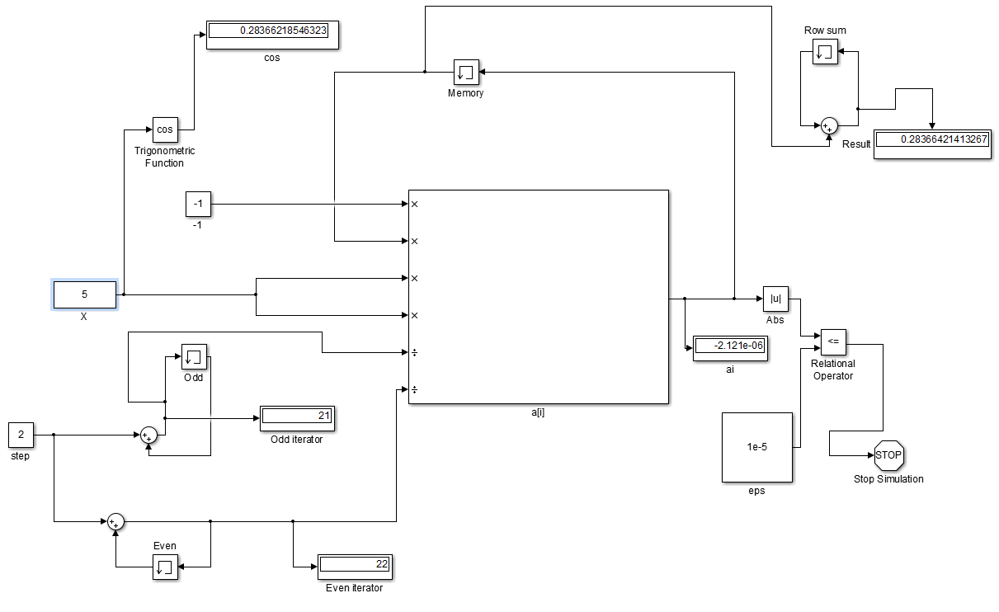

# hello-world
First repository
created during github newbee guide learning
added 3th and 4th lines
### Задание:
Предложите модель Simulink для расчета суммы ряда: 

  

  
 

### Модель:

  

  
 
Simulink model of cos using series 

