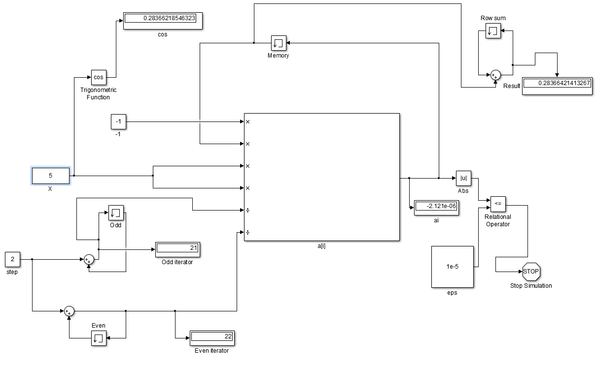

<pre>

 Министерство образования Республики Беларусь
 Учреждение образования
"Брестский государственный технический университет"
 Кафедра ИИТ

</pre>

<h2 align="center">Лабораторная работа 2</h2>
<h3 align="center">Знакомство с Simulink</h2>
 
 

**Выполнил:** 
Студент 3-го курса 
группы АС-48 
Николаев М.В. 
**Проверил:** 
 Пролиско.Е.Е.

Брест 2018

# Лабораторная работа 2

### Цель:
1) освоить основные операции используемые при построении модели
Simulink (перенос блоков, соединение, настройка параметров, запуск); 
2) построить модель вычислительного процесса на примере оценки
суммы ряда. 

### Задание:
Предложите модель Simulink для расчета суммы ряда: 

  
 

### Модель:

  
 
Simulink model of "cos(x)" using series 

### Вывод:
В ходе работы ознакомились с основными конструкциями Simulink, их назначением и способами работы с ними.
